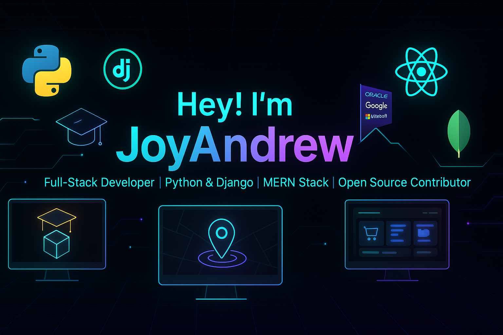

  

  

<h1 align="center" style="background: linear-gradient(135deg, #667eea 0%, #764ba2 100%); -webkit-background-clip: text; -webkit-text-fill-color: transparent; font-size: 3em; margin: 30px 0;">
  Let's Connect and Build Together! 🚀
</h1>

  
  
  

  

## 
👨‍💻 About Me

Hey there! I'm **Joy Andrew**, a **passionate Full Stack Developer** who loves to craft user-centric web applications and solve real-world problems using **Python, Django, MERN Stack**, and modern tech.

🌟 I thrive on building projects like **EduViz**, **NammaSpot**, and **Shophify**, blending creativity with robust engineering.

💡 I enjoy contributing to **open source**, creating **coding content** as **CodeCradle**, and sharing knowledge to inspire budding devs.

## 
💻 Competitive Programming

I love challenges and problem-solving! I regularly practice on **LeetCode**, **HackerRank**, **SkillRack** and **CodeChef** to stay sharp.

### 🏆 Profiles

  
  
  

  

  

## 
🌟 GitHub Analytics

  
  

  

## 
🌟 Featured Projects

  <table style="border-collapse: collapse; width: 100%; background: linear-gradient(135deg, #667eea 0%, #764ba2 100%); border-radius: 20px; overflow: hidden; box-shadow: 0 15px 35px rgba(0, 0, 0, 0.1);">
    <tr>
      <td width="50%" style="padding: 30px; border-right: 2px solid rgba(255, 255, 255, 0.1);">
        <h3 align="center" style="color: white; margin-bottom: 20px; font-size: 1.5em;">🎓 EduViz</h3>
        

          
            
          

            
            
            
          

          
<strong>Interactive 3D learning platform for engineering, physics, and medical education using Three.js & React.</strong>

        

      </td>
      <td width="50%" style="padding: 30px;">
        <h3 align="center" style="color: white; margin-bottom: 20px; font-size: 1.5em;">🚗 NammaSpot</h3>
        

          
            
          

            
            
            
          

          
<strong>Smart Parking System that solves real-world parking challenges with sensors and real-time slot tracking.</strong>

        

      </td>
    </tr>
  </table>

  

## 
🏆 Achievements

  

    <table style="width: 100%; border-collapse: collapse; color: white;">
      <thead>
        <tr style="background: rgba(255, 255, 255, 0.1); border-radius: 10px;">
          <th style="padding: 15px; border: 2px solid rgba(255, 255, 255, 0.2); border-radius: 10px; font-size: 1.1em;">🏅 Project</th>
          <th style="padding: 15px; border: 2px solid rgba(255, 255, 255, 0.2); border-radius: 10px; font-size: 1.1em;">🥇 Rank</th>
          <th style="padding: 15px; border: 2px solid rgba(255, 255, 255, 0.2); border-radius: 10px; font-size: 1.1em;">📍 Event</th>
          <th style="padding: 15px; border: 2px solid rgba(255, 255, 255, 0.2); border-radius: 10px; font-size: 1.1em;">💰 Prize</th>
        </tr>
      </thead>
      <tbody>
        <tr style="transition: all 0.3s ease;" onmouseover="this.style.background='rgba(255, 255, 255, 0.1)'" onmouseout="this.style.background='transparent'">
          <td style="padding: 15px; border: 1px solid rgba(255, 255, 255, 0.2); font-weight: bold;">EduViz</td>
          <td style="padding: 15px; border: 1px solid rgba(255, 255, 255, 0.2); color: #FFD700;">1st Place</td>
          <td style="padding: 15px; border: 1px solid rgba(255, 255, 255, 0.2);">Mini Project Expo, Vihansa</td>
          <td style="padding: 15px; border: 1px solid rgba(255, 255, 255, 0.2);">—</td>
        </tr>
        <tr style="transition: all 0.3s ease;" onmouseover="this.style.background='rgba(255, 255, 255, 0.1)'" onmouseout="this.style.background='transparent'">
          <td style="padding: 15px; border: 1px solid rgba(255, 255, 255, 0.2); font-weight: bold;">Shophify</td>
          <td style="padding: 15px; border: 1px solid rgba(255, 255, 255, 0.2); color: #FFD700;">1st Place</td>
          <td style="padding: 15px; border: 1px solid rgba(255, 255, 255, 0.2);">Project-Based Learning (Web Dev, Django)</td>
          <td style="padding: 15px; border: 1px solid rgba(255, 255, 255, 0.2);">—</td>
        </tr>
        <tr style="transition: all 0.3s ease;" onmouseover="this.style.background='rgba(255, 255, 255, 0.1)'" onmouseout="this.style.background='transparent'">
          <td style="padding: 15px; border: 1px solid rgba(255, 255, 255, 0.2); font-weight: bold;">NammaSpot</td>
          <td style="padding: 15px; border: 1px solid rgba(255, 255, 255, 0.2); color: #C0C0C0;">Runner-Up</td>
          <td style="padding: 15px; border: 1px solid rgba(255, 255, 255, 0.2);">College Level</td>
          <td style="padding: 15px; border: 1px solid rgba(255, 255, 255, 0.2); color: #90EE90;">₹5000 Cash Prize</td>
        </tr>
        <tr style="transition: all 0.3s ease;" onmouseover="this.style.background='rgba(255, 255, 255, 0.1)'" onmouseout="this.style.background='transparent'">
          <td style="padding: 15px; border: 1px solid rgba(255, 255, 255, 0.2); font-weight: bold;">Stacky Sparks Team</td>
          <td style="padding: 15px; border: 1px solid rgba(255, 255, 255, 0.2); color: #FFD700;">1st Place</td>
          <td style="padding: 15px; border: 1px solid rgba(255, 255, 255, 0.2);">IT Dept. Mini Project Expo</td>
          <td style="padding: 15px; border: 1px solid rgba(255, 255, 255, 0.2);">—</td>
        </tr>
      </tbody>
    </table>
  

  

## 
🛠️ Tech Stack

### 
🔧 Tools

  
  
  

### 
📌 Languages

  
  
  
  
  
  
  

### 
🚀 Frameworks

  
  
  
  

### 
💾 Libraries & Databases

  
  
  

### 
☁️ Cloud & Deployment

  
  
  

  

## 
🔭 Highlights

### ✨ Current Focus

🎥 Building **CodeCradle** — Instagram & Telegram for sharing real-time coding projects and inspiring developers worldwide.

### 🌍 Languages & Communication

🗣️ Fluent in **English** and **Tamil** - bridging cultures through technology.

### 💫 Community & Leadership

✨ Love **Leadership**, **organizing events**, and growing with the tech community. Always ready to collaborate and share knowledge!

### 🚀 Future Goals

🌟 Expanding open-source contributions and building innovative solutions that make a real impact on people's lives.

  

  

### 
💖 Thank you for visiting my profile!

  

---

  <strong>🌟 "Code is poetry written in logic" 🌟</strong>

